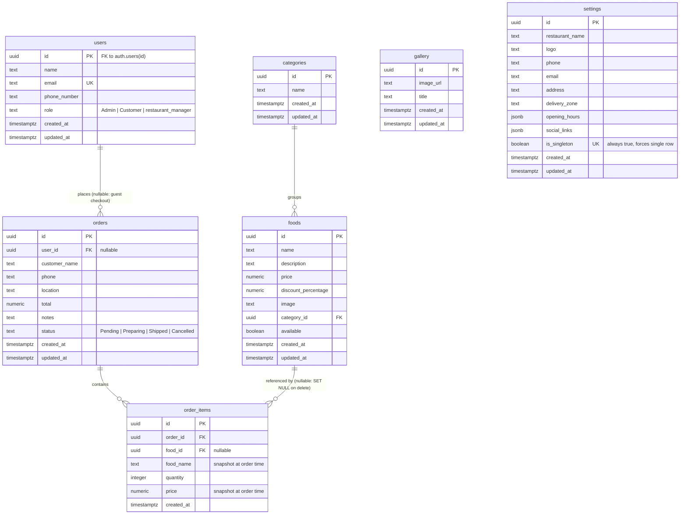
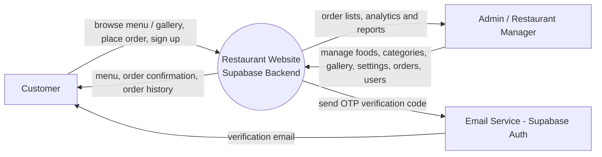
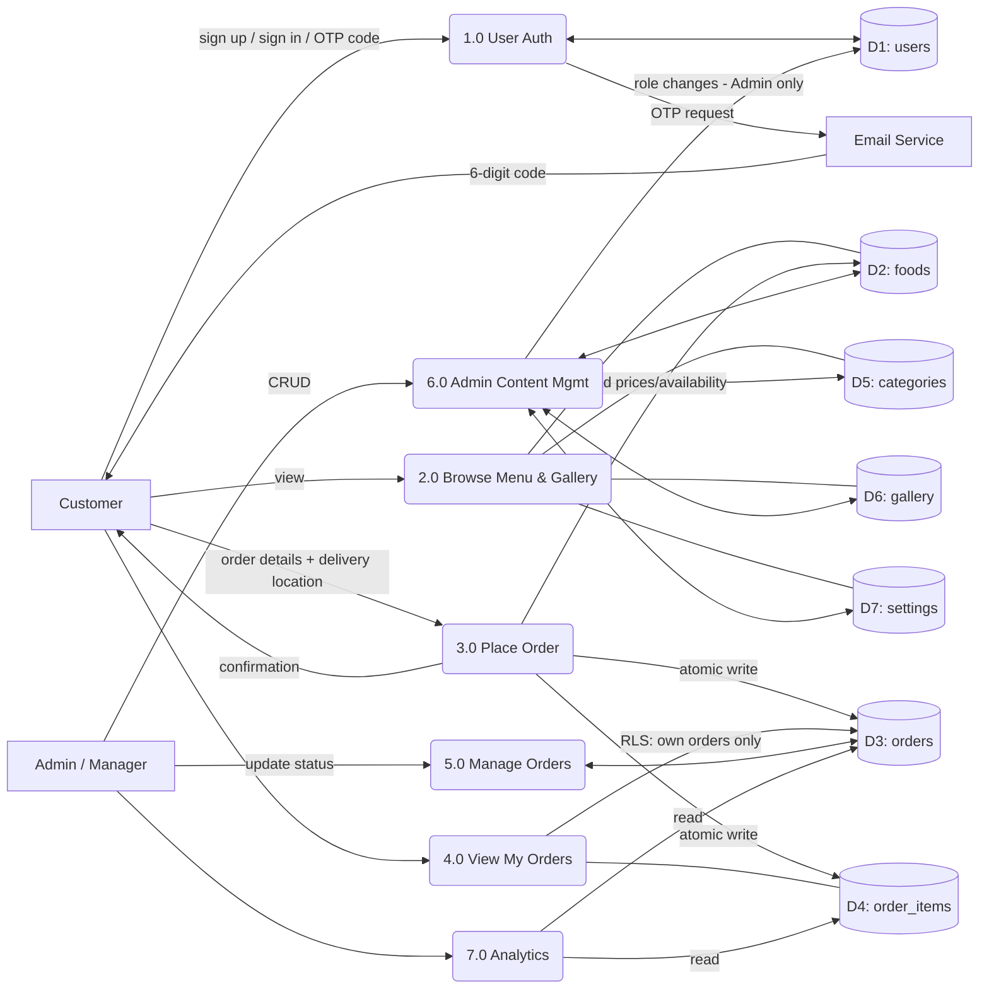
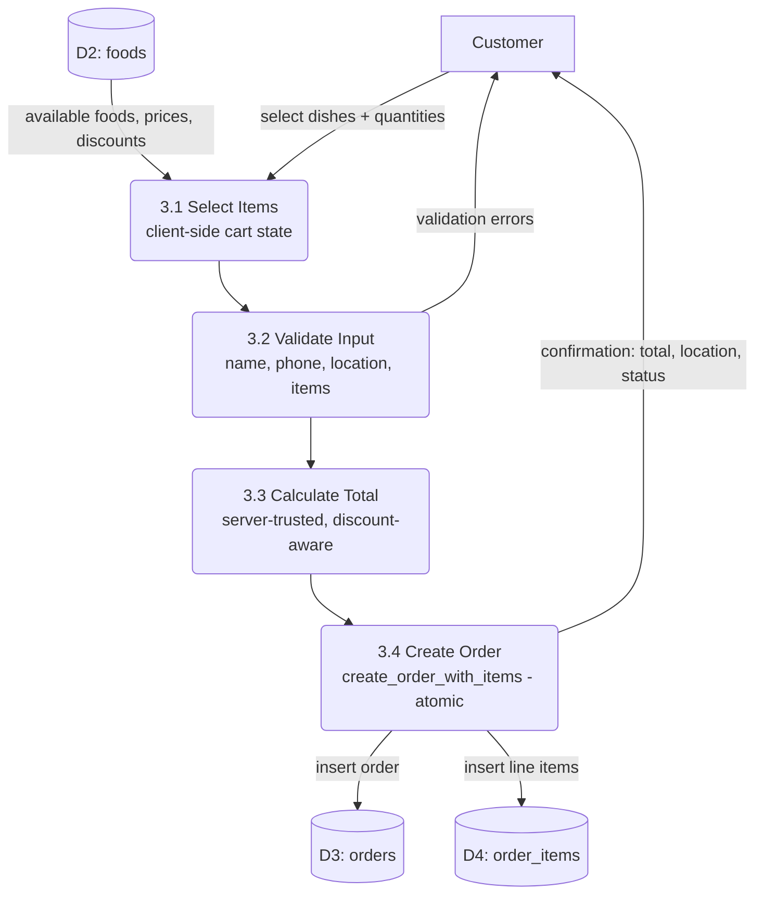

# Architecture Diagrams

These diagrams reflect the **implemented** system (`supabase/schema.sql` + the
React app), not a planned design. They can be pasted into
[Eraser](https://www.eraser.io/) via its "Diagram as code" panel, or any Mermaid
renderer, and restyled.

Scope notes (important for consistency):

- There is **no online payment** in the system — orders are placed and fulfilled
  without a charge, so there is no `payments` table, no Payment Gateway, and no
  payment process.
- **Reservations do not exist** — they were replaced by the ordering flow. There
  is no `reservations` table or process.
- The **cart is client-side React state**, not a database table, so it is not a
  data store in the DFD.
- The only outbound email is the **Supabase Auth OTP** sent during sign-up.

---

## Entity-Relationship Diagram (ERD)

`gallery` and `settings` are standalone (no foreign keys). `settings` is a
single-row table enforced by the unique `is_singleton` constraint.

---

## DFD Level 0 — Context Diagram

---

## DFD Level 1 — Major Processes

---

## DFD Level 2 — Place Order (Process 3.0)

The total is computed server-side (`OrderService.createOrder`) and never trusted
from the client form. The order and its line items are written in a single atomic
transaction via the `create_order_with_items` Postgres function, not two
sequential inserts.
